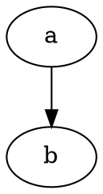

# Dependency injection container for Python

Briefly, container is for automatically instantiating classes.

## tl; dr


Example

```python3
# domain application example

```


```python3
import md.di.container

import your_domain.

container = md.di.container.Container()
 = container.get()


```

## About

This project is highly inspired by Symfony dependency injection container (Symfony is PHP web application framework) 

Easy instatiate service  


## Features:


All classes are synthetic services be default.

By default container tries to instantiate class as a service without configured definition for it, 
in this case definition is created automatically at runtime.


## How it works


- Service is 


to instantiate a class container should understand how to do it. This is possible to use instruction 
that describes how to instantiate a service, it's called *Service Definition* 


definition that built on fly (in runtime)


## Architecture overview




## Strategy (Roadmap):

- few container instances support
- cache
- unit test
- lazy services support
- parent services
- other injection type support
  - setter injection
  - property injection
- `typing` support 
- do not use `inspect` module

## Compare with Symfony/container

### Configuration

- definition has no arguments indexed by number


## Integration with application


## Requirements

- Python 3.5+

## Status

Current status: development preview. not for production usage.

## License
